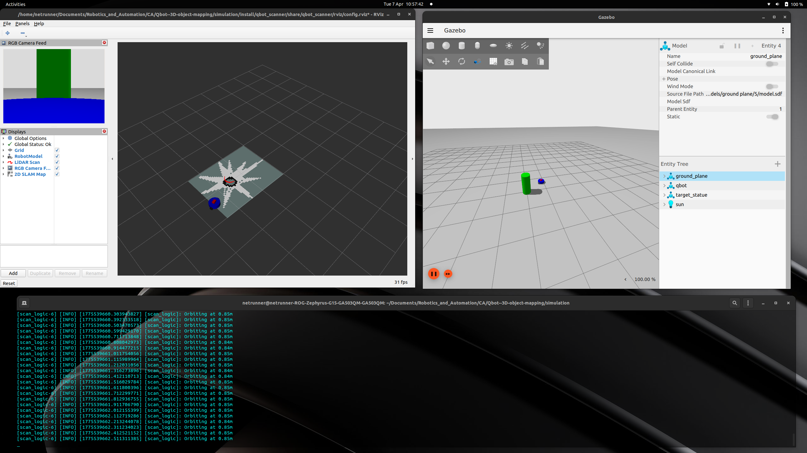

# Qbot: Autonomous 3D Object Scanner & Mapper


## 📌 Project Overview
This project features a ROS 2 based differential-drive robot (Qbot) designed to autonomously identify, approach, and orbit a target object in a simulated environment. As it executes a precision orbit, it uses an onboard RGBD camera to generate a rich **3D Point Cloud** of the object while simultaneously using a 2D LiDAR to map the surrounding room via SLAM.

### 🎯 Key Features
* **Autonomous Target Tracking:** Uses planar 2D LiDAR data to locate the target object while ignoring background walls using spatial filtering.
* **Precision Orbiting:** Implements proportional control to maintain a perfect orbital radius based on the camera's Vertical Field of View (FOV) and the object's height.
* **3D Point Cloud Generation:** Captures high-fidelity spatial data using an RGBD sensor to recreate the 3D object in RViz.
* **Auto-Termination Logic:** Integrates angular velocity over time to track laps, automatically halting the robot after completing exactly 3 full orbits.
* **Simultaneous 2D Mapping:** Runs `slam_toolbox` asynchronously to generate a 2D occupancy grid of the environment during the scanning process.

---

## 👥 Team Members
* **Dineth Sankalpa** 
* **Sanjuna Rathnamalala**
* **Binara Herath**

---

## 📷 System Visualization


> *Above: The captured 3D point cloud of the target object visualized in RViz during the autonomous orbiting phase.*

---

## 🛠️ Prerequisites
To run this simulation, you need the following installed on an Ubuntu 22.04 system:
* **ROS 2 Humble**
* **Ignition Gazebo** (Fortress or newer)
* **ROS 2 Packages:**
  ```bash
  sudo apt install ros-humble-ros-gz-bridge
  sudo apt install ros-humble-ros-gz-sim
  sudo apt install ros-humble-slam-toolbox
  sudo apt install ros-humble-xacro

## 🚀 Build & Installation

1. Clone the repository:
`git clone https://github.com/IntellisenseLab/final-project-slam.git`
cd Qbot--3D-object-mapping/simulation

2. Build the workspace:
`colcon build --symlink-install`

3. Source the environment:
`source /opt/ros/humble/setup.bash`
`source install/setup.bash`

## 🎮 Usage
Launch the entire software stack (Gazebo Simulation, Robot State Publisher, Bridge, SLAM Toolbox, RViz2, and the Autonomous Control Node) with a single command:
Bash
`ros2 launch qbot_scanner qbot_bringup.launch.py`

## What to Expect:

    The Qbot will spawn in the Ignition Gazebo world facing the central object.

    It will drive forward at 0.15 m/s until it reaches the calculated optimal scanning radius.

    It will lock onto the object and execute a continuous, smooth orbit.

    In RViz, you will see the 2D map generating, the TF tree actively updating, and the 3D Point Cloud capturing the object.

    After exactly 3 complete laps, the robot will safely park itself and terminate movement commands.

## 📁 Repository Structure
```text

Qbot--3D-object-mapping/
│
├── media/                       # images and videos of the simulations
├── weekly_reports/              # weekly reports 
├── simulation/                  # Main ROS 2 Workspace
│   ├── src/
│   │   └── qbot_scanner/        # Custom Python Package
│   │       ├── config/          # SLAM and RViz parameters
│   │       ├── launch/          # Master bringup files
│   │       ├── qbot_scanner/    # Control logic (scan_logic.py)
│   │       ├── urdf/            # Robot physical description
│   │       └── worlds/          # Ignition Gazebo environments
│   │
│   └── README.md                # You are here!
│
└── .gitignore                   # Keeps the repo clean from b
```
